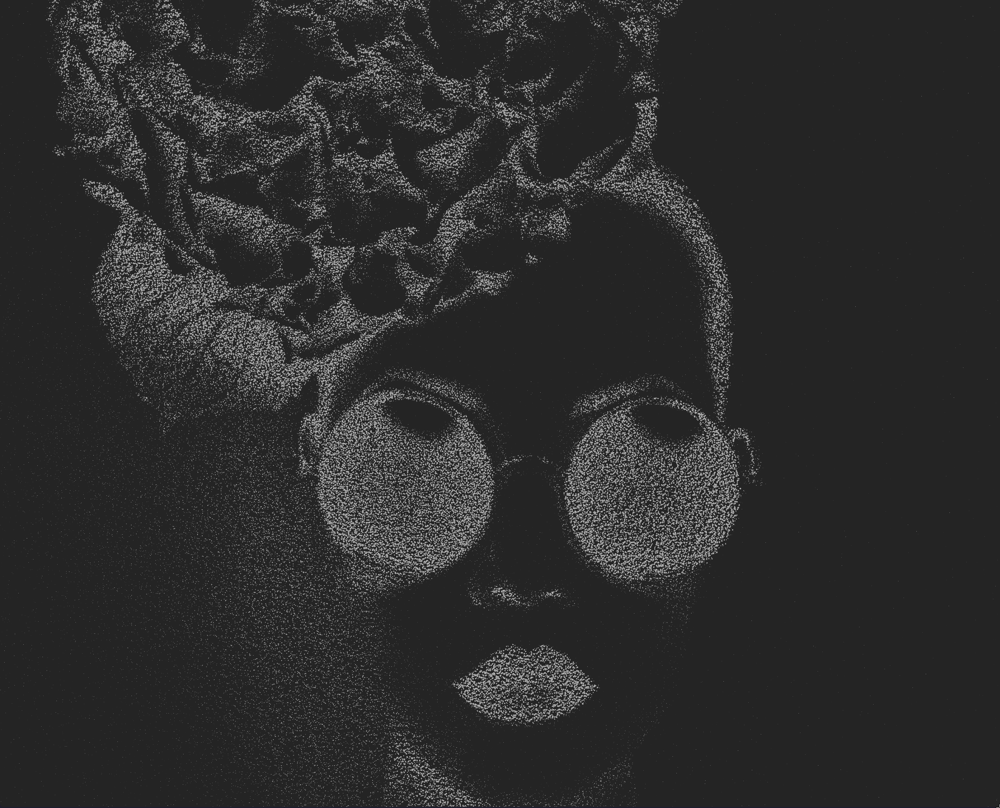

# Interactive Particles



A React component that converts images into interactive particle systems using WebGL. Particles respond to mouse movement and clicks with smooth animations and ripple effects.

## Features

- Image-to-particle conversion with customizable threshold
- Mouse interaction with touch trail effects
- Click-triggered ripple animations
- Responsive and performant

## Installation

```bash
# or use any other package manager
bun install

```

## Usage

```tsx
import InteractiveParticles from './components/interactive-particles/interactive-particles'

function App() {
  return (
    <div className="w-full h-full">
      <InteractiveParticles 
        image="/example.jpg"
        threshold={200}
        density={1}
        color="#bbbbbb"
        size={0.8}
      />
    </div>
  )
}
```

## Props

| Prop | Type | Default | Description |
|------|------|---------|-------------|
| `image` | `string` | required | Path to the image file (relative to public folder) |
| `threshold` | `number` | `200` | Brightness threshold (0-255). Lower values = more particles |
| `density` | `number` | `1` | Camera distance multiplier. Lower values = denser particle field |
| `color` | `string` | `"#bbbbbb"` | Particle color (hex format) |
| `size` | `number` | `0.8` | Particle size multiplier |
| `className` | `string` | `undefined` | Additional CSS classes for the container |

## Technical Details

### Technologies
- WebGL (via OGL library)
- GSAP for animations
- Tailwind CSS

### How It Works

1. **Image Processing**: Converts image pixels to particle coordinates based on luminance values
2. **Threshold Filtering**: Uses ITU-R BT.709 luminance standards to determine which pixels become particles
3. **Dithering**: Applies ordered dithering for smoother particle distribution
4. **WebGL Rendering**: Utilizes instanced rendering for performance (Thank you ogl)
5. **Interaction**: Raycasting for mouse interaction with touch texture feedback

## License

MIT

